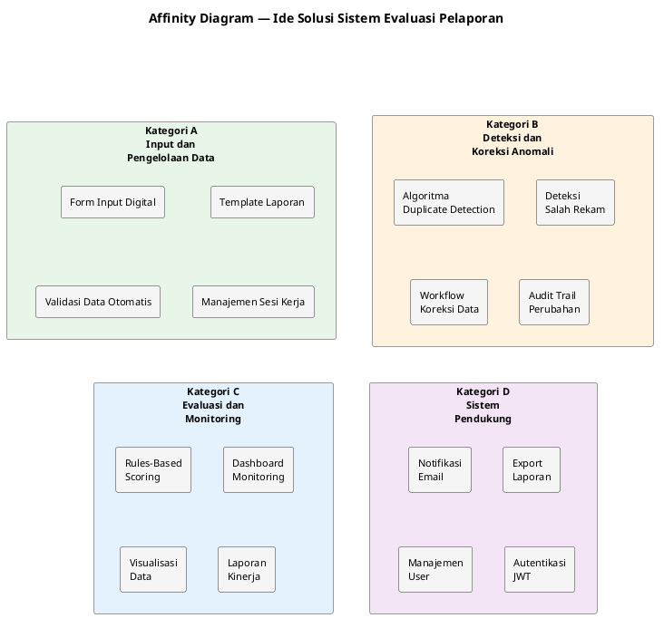

# Prompt UML — §4.3.2 Affinity Diagram

Paste ke kroki.io/plantuml:

```plantuml
@startuml
skinparam backgroundColor white
skinparam defaultFontName Arial
skinparam defaultFontSize 11
skinparam shadowing false
skinparam rectangle {
  BackgroundColor #F5F5F5
  BorderColor #333333
  RoundCorner 5
}
skinparam package {
  BackgroundColor #FAFAFA
  BorderColor #999999
}

title Affinity Diagram — Ide Solusi Sistem Evaluasi Pelaporan

rectangle "**Kategori A**\nInput dan\nPengelolaan Data" as A #E8F5E9 {
  rectangle "Form Input Digital" as a1
  rectangle "Template Laporan" as a2
  rectangle "Validasi Data Otomatis" as a3
  rectangle "Manajemen Sesi Kerja" as a4
}

rectangle "**Kategori B**\nDeteksi dan\nKoreksi Anomali" as B #FFF3E0 {
  rectangle "Algoritma\nDuplicate Detection" as b1
  rectangle "Deteksi\nSalah Rekam" as b2
  rectangle "Workflow\nKoreksi Data" as b3
  rectangle "Audit Trail\nPerubahan" as b4
}

rectangle "**Kategori C**\nEvaluasi dan\nMonitoring" as C #E3F2FD {
  rectangle "Rules-Based\nScoring" as c1
  rectangle "Dashboard\nMonitoring" as c2
  rectangle "Visualisasi\nData" as c3
  rectangle "Laporan\nKinerja" as c4
}

rectangle "**Kategori D**\nSistem\nPendukung" as D #F3E5F5 {
  rectangle "Notifikasi\nEmail" as d1
  rectangle "Export\nLaporan" as d2
  rectangle "Manajemen\nUser" as d3
  rectangle "Autentikasi\nJWT" as d4
}

A -[hidden]right-> B
B -[hidden]right-> C
C -[hidden]right-> D

@enduml
```
